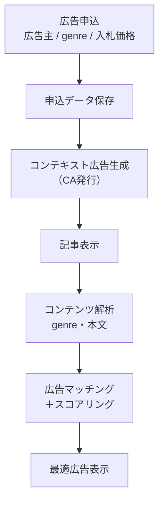
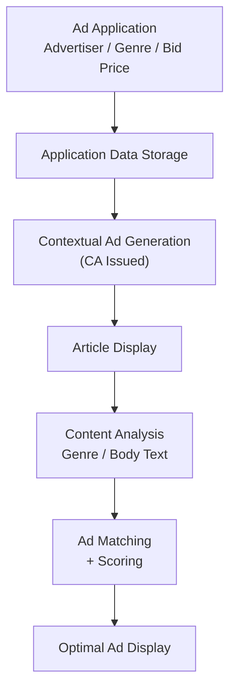

# ca-manager-extended-unofficial
🇺🇸 For English readers:
[Jump to English version](#english)

本プラグインは、WordPress（WP）向けのContent Attestation（CA）発行・検証対応プラグインです。


* WP以外のCMS環境では、[Concrete CMSの最小実装プラグイン](https://github.com/yoshid8s/concrete-ca-manager)があります。

本実装は、OP-CIP提供の公式CA Manager（v0.4.3）をベースに独立して実験的に拡張を行ったもので非公式バージョンです。<br>
公式版との差分レポートをまとめていますので、[こちらを参照](https://github.com/yoshid8s/ca-manager-extended-unofficial/blob/main/docs/difference_from_original.md)してください。<br>
<br>
記事CAと広告配信を連動させたコンテキスト広告システムを実装しています。<br>
<br>
広告CAは本来、広告主が署名することが想定されていますが、<br>
本実装では、広告配信と記事CAの連動モデルを示すために、<br>
<br>
メディア側で広告CAを発行する構成を採用しています。<br>
これは、広告主・メディア間の信頼関係に基づく実運用を想定したモデルの一例です。<br>
<br>
これは、広告主側でのOP/CA実装の負担を考慮した暫定的な設計であり、<br>
OPが普及した段階では、広告主自身によるCA発行との連携を前提としています。

## Compatibility

本プラグインは、従来型（クラシック）テーマを前提として実装されています。

動作確認済み：
- Chic
- Twenty Eleven
- ドラッグ＆ドロップ型の専用ビルダー（Colibri）

専用ビルダー環境のColibriでは、動作確認済みですが、
その他の専用ビルダーでは、DOM構造の違いにより正常に動作しない可能性があり、
今後の対応が必要です。

# CA Manager Extension 

CA Manager（v0.4.3）をベースに、
WordPress上での実運用を想定して拡張した実装です。

最新版（v0.4.8）は [Releases](https://github.com/yoshid8s/ca-manager-extension/releases) からダウンロードできます。
最新版では、X（Twitter）向けの OPベース記事ブロック共有機能にも対応しました。

v0.4.6 では、srcset/currentSrc を持たない WordPress の Latest Posts サムネイル画像に対して、複数 integrity を付与すると検証失敗するケースを修正しました。
srcset を持たない画像については、単一 integrity を利用するよう改善しています。

なお、専用ビルダー環境（v0.4.7-colibri-beta1）も開発済みですが、その他の環境での動作確認を行なっていないため、最新版（v0.4.8）をご利用ください。

## CA Manager Extension の適用範囲拡張バージョン：CAメタデータ連動広告管理（プロトタイプ）

- v0.4.6-1では、Content Attestation（CA）のメタデータを活用したコンテキスト広告管理機能（初期開発版）を追加しました。記事のgenreと本文内容に基づき、広告をマッチング・表示・計測する仕組みです。
- v0.4.7-colibri-beta1では、コンテンツ認証 (CA) 検証のための 専用ビルダーColibri 固有の互換性レイヤーを導入しました。Colibri ベースの WordPress サイトでのテスト中に、Swiper が swiper-slide-duplicate を使用してスライダーの DOM 要素を内部的に複製していたため、一部のページで CA 検証が失敗することが判明したため、Swiper によって生成された重複スライドから重複した op-body-* ID を削除するフロントエンド対策を追加しました。

## コンテキスト広告の仕組み

本プラグインでは、記事内容および広告申込データに基づき、コンテキストに適した広告を自動表示します。

### 全体フロー

---



---

### 広告選択ロジック

コンテキスト広告は以下の条件で選択されます。

- 記事の `genre` と広告の `genre` が一致
- 掲載期間内である
- 有効化されている広告である
- 記事本文に広告主名が含まれる場合はスコア加算
- （将来）入札価格（bid_price）による優先順位付け

---

### 特徴

- 広告申込データをそのまま配信ロジックに反映
- CMS内で完結する広告管理
- コンテンツと広告の意味的整合性を担保
- 将来的な入札型広告（オークションモデル）に対応可能

---

### 実装例

ファッションブログ「JiJi Style」
https://style.yh-inc.jp/ <br>
（実際にコンテキスト広告と記事CAが連動して動作しています）

- スーツに関するページには、スーツブランドの広告が表示され
- カジュアルウェアに関するページには、カジュアルブランドの広告が表示されます。  
→ 記事 genre と同じ genre の広告のみ表示対象  
→ 記事内に特定ブランド名が含まれる場合は、該当ブランドが優先表示されます。  

---

### 今後の拡張

- 入札価格ベースの広告ランキング
- 複数広告のオークション選択
- CTR・表示回数ベースの最適化


詳しくは以下のリリースをご覧ください。

- https://github.com/yoshid8s/ca-manager-extension/releases/tag/v0.4.6-1

## 主な機能
- 投稿単位でのCA管理
- 広告CA（OnlineAd）
- 埋め込みコンテンツCA
- 記事CAの一括発行機能
- 複数記事に対するCA発行
- コンテキスト広告管理機能
- UIイメージ例（下図）

## 管理画面（設定・一括発行）
CA設定および記事CAの一括発行を行う管理画面です。


## 編集画面例（個別CA管理）
編集ページで個別にCA発行を行う画面です。記事CAだけでなく、広告CAや第三者からの引用テキストCA・引用画像CAも発行できます。


## 位置付け
本実装は、OPにおける「個別セレクター単位でのCA発行」という前提を、
CMS環境で実装可能にするためのリファレンス実装です。

## 対象ユーザー

- WordPressサイト運営者
- コンテンツの真正性・出所を証明したい開発者
- Content Attestation（CA）やOPに関心のある技術者

## 目次

- [主な機能](#主な機能)
- [更新履歴](#更新履歴)
- [画像Integrity処理について](#画像integrity処理について)
- [インストール方法](#インストール方法)
- [使い方](#使い方)

## CA Manager Extension (v0.4.3-2)

バグ修正しました。更新履歴を参照ください。

## Latest update (v0.4.4-1)

- 記事CAの一括発行機能を追加
- 複数記事に対するCA発行の安定性を改善

---

## 主な機能

- 記事本文のCA発行（TextTargetIntegrity）
- 埋め込み画像のCA発行（ExternalResourceTargetIntegrity）
- 広告コンテンツのCA発行
- WordPress編集画面からCA管理
- CAS（application/cas+json）の自動埋め込み
- 記事CAの一括発行機能
- 複数記事に対するCA発行

---

## 更新履歴

### v0.4.4-1（2026-04）

- 記事CAの一括発行機能を追加
- 複数記事に対するCA発行の安定性を改善

### v0.4.3-2（2026-04）

#### バグ修正

**1. srcset画像のExternalResourceTargetIntegrity修正**
- `srcset` による複数ハッシュを分割していた問題を修正
- 各画像の `integrity` 属性を1つの値として扱うように変更

**2. 記事CAに画像が含まれない問題**
- main article CA に `external_resources` が渡されていなかった不具合を修正
- 埋め込み画像CAが無い場合、記事CAに画像整合情報が含まれるよう改善

**3. CA間の整合性修正**
- 以下の処理を統一：
  - 記事CA
  - 埋め込み画像CA
  - 広告CA
- 検証エラーの原因となる不整合を解消

---

## 画像Integrity処理について

本プラグインでは、``タグの `integrity` 属性に複数のハッシュ値が含まれる場合（例：srcset）でも、
それらを分割せず、1つのintegrity値として扱います。

- integrity値はそのまま1つの文字列として使用
- 個別ハッシュに分割しない
- 対象：
  - 記事CA
  - 埋め込み画像CA
  - 広告CA

これにより、検証の安定性を確保しています。

---

## インストール方法

### 方法①（開発者向け）

```bash
git clone https://github.com/yoshid8s/ca-manager-extension.git
WordPressの `wp-content/plugins/` に配置し、管理画面から有効化してください。
```

### 方法②（手動）

リポジトリをダウンロード
フォルダをZIP化
WordPress管理画面からアップロード

### 使い方

- 投稿編集画面を開く。
- CAマネージャーで対象コンテンツを選択。
- 保存するとCASが自動生成される。

### 注意事項

srcsetを含む画像はブラウザ実DOMと一致する必要があります。
HTML構造の変更は検証エラーの原因になります。

### 作者

Yoshifumi Takeuchi

## License: 

MIT License

<a id="english"></a>

# English Version

# ca-manager-extension
This plugin is a WordPress plugin that supports Content Attestation (CA) issuance and verification.


* For CMS environments other than WordPress, there is the [Concrete CMS Minimal Implementation Plugin](https://github.com/yoshid8s/concrete-ca-manager).

This implementation is an unofficial extended version based on the official CA Manager (v0.4.3) provided by OP-CIP, with independent experimental features and practical WordPress enhancements.

It includes a contextual advertising system that links article CAs and ad delivery.

<br>
While ad CAs are originally intended to be signed by advertisers,
<br>
This implementation adopts a configuration where the media issues the ad CA to demonstrate a linked model between ad delivery and article CAs.

<br>
This is an example of a model that assumes practical operation based on a trust relationship between advertisers and media.

<br>
This is a provisional design that considers the burden of OP/CA implementation on the advertiser side, and<br>
It is assumed that once OP becomes widespread, it will be linked to CA issuance by the advertiser themselves.

## Compatibility

This plugin is implemented assuming a traditional (classic) theme.

Tested and confirmed to work:
- Chic
- Twenty Eleven
- Drag-and-drop type dedicated builders (Colibri)

While it has been confirmed to work with the dedicated builder environment Colibri,
it may not function correctly with other dedicated builders due to differences in DOM structure, and further support is needed.

# CA Manager Extension

This is an extended implementation based on CA Manager (v0.4.3), designed for practical use on WordPress.

The latest version (v0.4.6) can be downloaded from [Releases](https://github.com/yoshid8s/ca-manager-extension/releases).
The latest version now supports OP-based article block sharing for X (Twitter).

v0.4.6 fixed an issue where applying multiple integrity values ​​to WordPress Latest Posts thumbnail images that did not have srcset/currentSrc would cause validation to fail.
For images without srcset, it now uses a single integrity rating.

Note that a dedicated builder environment (v0.4.7-colibri-beta1) has also been developed, but since its operation has not been confirmed in other environments, please use the latest version (v0.4.8).

## CA Manager Extension Application Scope Extended Version: CA Metadata-Linked Ad Management (Prototype)

v0.4.6-1 adds a contextual ad management function (initial development version) that utilizes Content Attestation (CA) metadata.
This mechanism matches, displays, and measures ads based on the article's genre and content. ## Contextual Ad Mechanism
This plugin automatically displays contextually relevant ads based on article content and ad application data.

### Overall Flow

---



---

### Ad Selection Logic

Contextual ads are selected based on the following conditions:

- The article's `genre` matches the ad's `genre`.
- Within the ad's publication period.
- The ad is active.
- Score is added if the advertiser's name is included in the article text.
- (Future) Prioritization based on bid price (bid_price)

---

### Features

- Ad application data is directly reflected in the delivery logic.
- Ad management is completed within the CMS.
- Ensures semantic consistency between content and ads.
- Supports future auction-type advertising.

---

### Implementation Example

Fashion blog "JiJi Style"
https://style.yh-inc.jp/ <br>
(Contextual ads and article CA are actually working in conjunction.)

- Ads from suit brands are displayed on pages about suits.
- Ads from casual wear brands are displayed on pages about casual wear.
→ Only ads of the same genre as the article's genre are displayed.
→ If a specific brand name is included in the article, that brand will be displayed preferentially.

---

### Future Expansions

- Bid-based ad ranking
- Auction selection for multiple ads
- CTR/impression-based optimization

For details, please see the following release:

- https://github.com/yoshid8s/ca-manager-extension/releases/tag/v0.4.6-1

## Main Features
- CA management per post
- Ad CA (Online Ad)
- Embedded content CA
- Bulk article CA issuance function
- CA issuance for multiple articles
- Contextual ad management function
- Example UI image (see diagram below)

## Management Screen (Settings/Bulk Issuance)

This is the management screen for CA settings and bulk issuance of article CAs.


## Example Editing Screen (Individual CA Management)
This screen allows you to issue CAs individually on the editing page. You can issue not only article CAs, but also ad CAs, quoted text CAs from third parties, and quoted image CAs.


## Positioning
This implementation is a reference implementation to enable the implementation of the premise of "issuing CAs on an individual selector basis" in the OP within a CMS environment.

## Target Users

- WordPress site administrators
- Developers who want to prove the authenticity and source of their content
- Engineers interested in Content Attestation (CA) and OP (Open Source)

## Table of Contents

- [Main Features]
- [Update History]
- [Image Integrity Processing]
- [Installation Instructions]
- [How to Use]

## CA Manager Extension (v0.4.3-2)

Bug fixes. Please refer to the update history.


## Latest update (v0.4.4-1)

- Added bulk CA issuance function for articles
- Improved stability of CA issuance for multiple articles

---

## Main Features

- CA issuance for article body (TextTargetIntegrity)
- CA issuance for embedded images (ExternalResourceTargetIntegrity)
- CA issuance for advertising content
- CA management from WordPress editing screen
- Automatic embedding of CAS (application/cas+json)
- Bulk CA issuance function for articles
- CA issuance for multiple articles

---

## Update History

### v0.4.4-1 (2026-04)

- Added bulk CA issuance function for articles
- Improved stability of CA issuance for multiple articles

### v0.4.3-2 (2026-04)

#### Bug fixes

**1. **Fixed ExternalResourceTargetIntegrity for srcset images**
- Fixed an issue where multiple hashes from `srcset` were being split.
- Changed the `integrity` attribute of each image to be treated as a single value.

**2. Issue where images were not included in article CA**
- Fixed a bug where `external_resources` was not being passed to the main article CA.
- Improved so that image integrity information is included in the article CA when there is no embedded image CA.

**3. Corrected consistency between CAs**
- Unified the following processes:
- Article CA
- Embedded image CA
- Advertisement CA
- Resolved inconsistencies that caused validation errors.

---

## About Image Integrity Processing

In this plugin, even if the `integrity` attribute of the `` tag contains multiple hash values ​​(e.g., srcset),
they are not split and are treated as a single integrity value.


- Integrity value is used as a single string.
- Do not split into individual hashes.
- Target:
- Article CA
- Embedded Image CA
- Ad CA

This ensures the stability of validation.

--
## Installation Method

### Method 1 (For Developers)

```bash
git clone https://github.com/yoshid8s/ca-manager-extension.git
Place it in `wp-content/plugins/` in WordPress and activate it from the admin screen.
```

### Method 2 (Manual)

Download the repository
ZIP the folder
Upload from the WordPress admin screen

### How to Use

- Open the post editing screen.
- Select the target content in CA Manager.
- Save and CAS will be automatically generated.

### Notes

Images containing srcset must match the actual browser DOM.
Changing the HTML structure will cause validation errors.

### Author

Yoshifumi Takeuchi

## License:

MIT License

## Notice

This project is based on the official CA Manager developed by the Originator Profile (OP) project, with additional modifications and extensions.

## Notice

This project is based on the official CA Manager developed by the Originator Profile (OP) project, with additional modifications and extensions.
